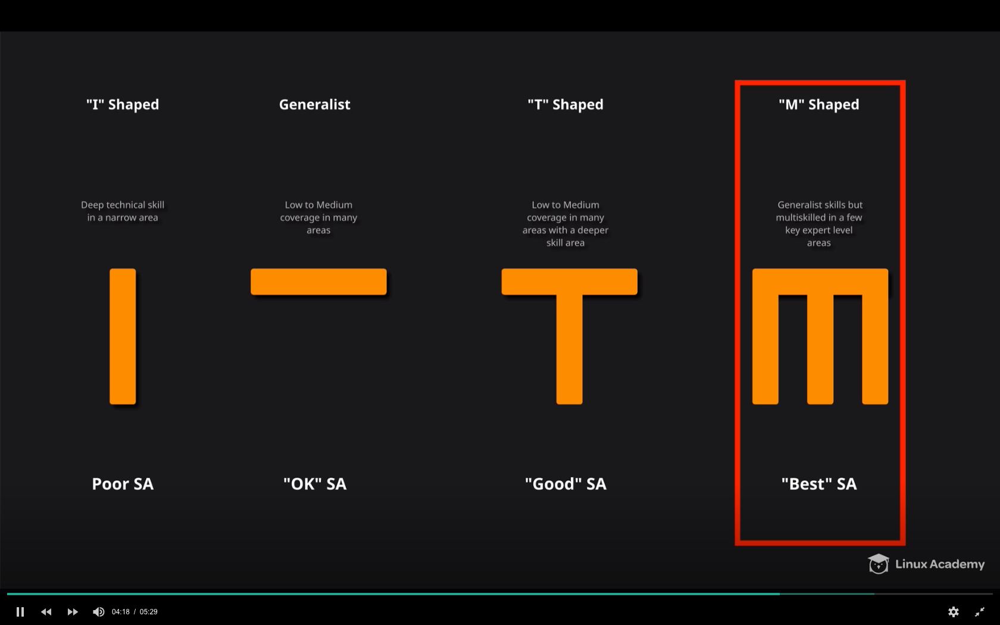
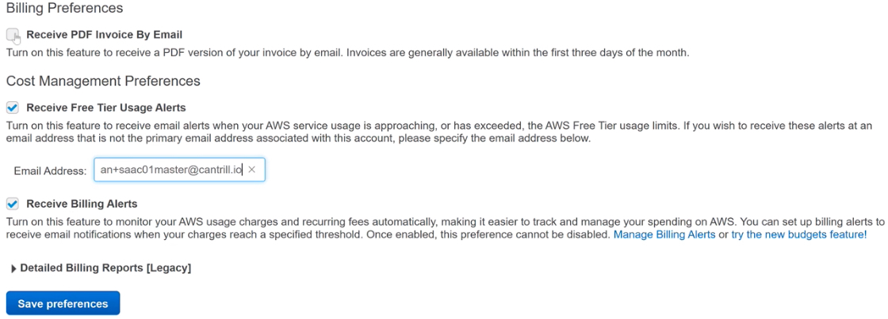
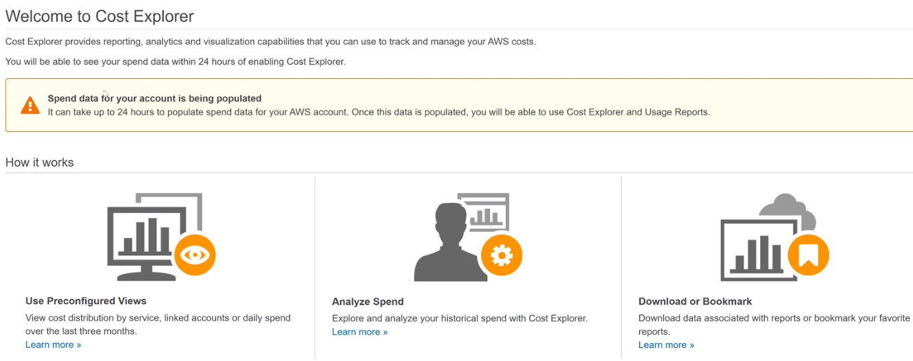
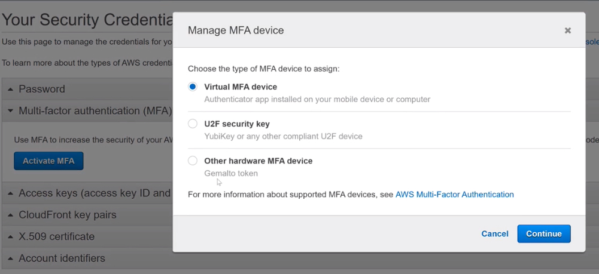

---

layout: post

title: AWS CSA - Associate Level 学习笔记 - Week 1

img: AWS_CSA_001.png

---

### Notes AWS Certified Solutions Architect - Associate Level (Prep Course) - Week 1

##### Day 1

成为**M类型**的架构师。

具备知识的广度，宽度，同时也对一些部分具备深度的知识。或者可以快速学习这些知识的能力。

所谓Solution Architect，这个人的工作是在客户和实施工程师之间，为客户按照需求设计他们的云架构。并且在安全性，灵活性，性能等方面做到优化的配置。

- 这一部分有两项任务，或者最佳实践：
  * 设置Billing
  * 设置MFA

- 设置AWS账号，Free Tier，安全设置

  - Email，密码，信用卡，MFA
  - 公司账户： Professional
  - 个人账户：Personal

- AWS Management Console

  - 账号创建成功，登陆后，进入
  - 可以通过my billing&cost management console设置使用量和账单管理，当费用超过free tier的价格时，可以发送alert到指定的email地址。

  

  

  

- 也可以通过**CloudWatch**设置alarm来监控，通过SNS服务，当估算的费用超过10美元时，发送警报

- 另外一点，通过enable Cost Explorer可以收集各种服务所涉及的费用，使用量等等的信息。可以在billing&cost management console进行设置。

  

- 为了提高root用户的安全性，可以对root用户设置MFA

  这样设置成功后，每次登陆root账户，输入email和密码后，需要输入MFA Code才能login。

  

  