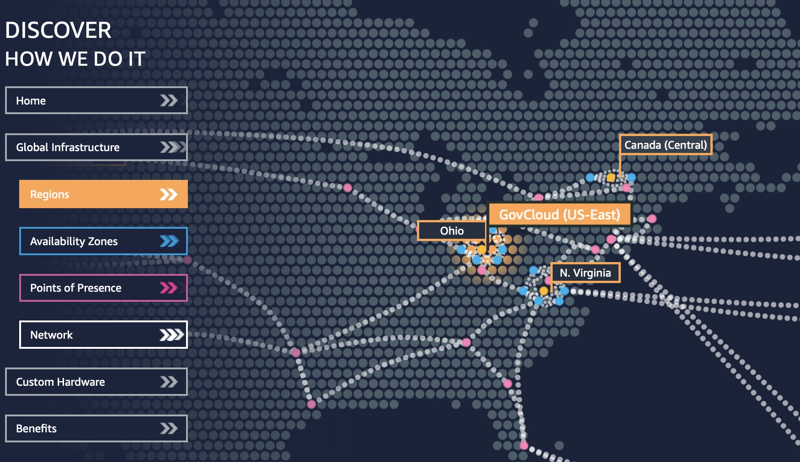
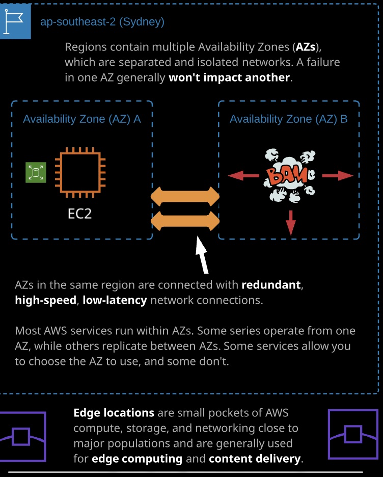
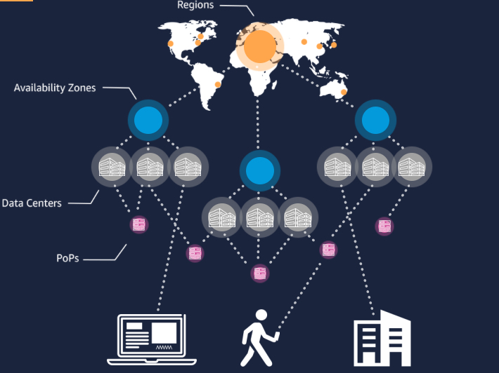
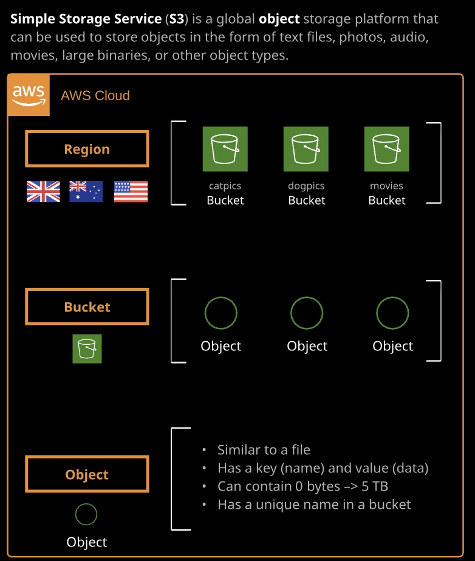

---

layout: post

title: AWS CSA - Associate Level 学习笔记 - Week 1 - Part II

img: image-20190828072916029.png

---

### Day 3

- AWS Accounts: "AWS accounts are more than just a way to log in and access AWS services — they are a crucial AWS feature that AWS solutions architects can use to implement secure and high-performance systems."
  - 三个功能
    - 认证
    - 授权
    - 账单

**Tips**： Cloud Playground的Sandbox可以使用AWS的测试账户。

- AWS Pysical and Network layer

  - Global Infrastructure: 

    - Region: local grouping of infrastructure, 2各部分构成：region code，比如us-east-1。region name，例如 US East (N.Virginia)。有些服务例如S3是全球都可以使用，所以在S3里面看到的就不是具体的Region名称，而是用Global表示。Region之间通过高速的网络连接互相联通，这样服务就可以通过这个专有的高速网络交互。而不是使用Internet。所以从架构设计的角度，应该更多的使用这个网络。
    - AZ: 每个Region由多个AZ组成。例如图中的黄色点代表Region，蓝色的点代表围绕或构成这个Region的AZ。重点要明白多个AZ对于你的架构设计有何种的影响。AZ是在一个Region中地理上相互隔离的区域。AZ之间由冗余的，高速，低延迟网络相互连接。大部分的中小型企业会选择在一个Region中，通过多个AZ的方式达到高可用性和容灾，也可能利用其他的Region做DR。大型企业例如Netflix会选在跨Region的多个AZ设计他们的架构。
    - DataCenter：在一个AZ中，可以有1个或多个DC。4个层面的设计。

    [AWS Global Infrastructure Live](https://www.infrastructure.aws)

​				

AWS的全球基础架构按照==分层的方式==进行的设计。

- Well-Architected Framework

  - A set of documents and tools: 

    - [AWS Well-Architected Framework](https://d1.awsstatic.com/whitepapers/architecture/AWS_Well-Architected_Framework.pdf)
    - [AWS架构完善网站](https://aws.amazon.com/cn/architecture/well-architected/)
    - [AWS Well-Architected Tool](https://aws.amazon.com/cn/well-architected-tool/)

  - A set of Best Practices, White papers, Principles

  - 5 pillars

    - Security
    - Reliability
    - Performance Effciency
    - Operational Excellence
    - Cost Optimization

  - Elastic - 弹性

    - Vertical, Horizontal, Elastic
    - 业务量稳定型：适用于Vertical
    - 持续线性增长型业务：适用于横向扩展
    - 业务有周期性高低变化的：适用于Elastic，通过自动化的scaling和横向扩展的组合来实现。==scale out and in==。

    从架构角度，弹性可以实现成本的优化，性能的最优化。

- **总结**：截止到目前的内容都是理论上的知识。非常有指导性，是在设计架构中不可获取的关键的设计原则和理念。需要时常回顾。<u>特别是well architected里面的关于5个支柱的文档</u>，工具。

#### Console Tour

浏览AWS Management Console的菜单，服务功能等。

服务按照不同的类型组织到一起。

Tips：

- 可以使用顶端的搜索栏快速找到服务
- 点击AWS的图标可以快速回到主页
- 使用顶端的pin功能，可以把常用的服务放到顶端。这个功能可以用于在做项目中，把常使用到的服务放到顶端。

- Introduction of S3: Simple Storage Service, 全球的对象存储服务。
  - 很适合存放，视频，音频，图片，日志，大型的二进制文件等对象等
  - 

