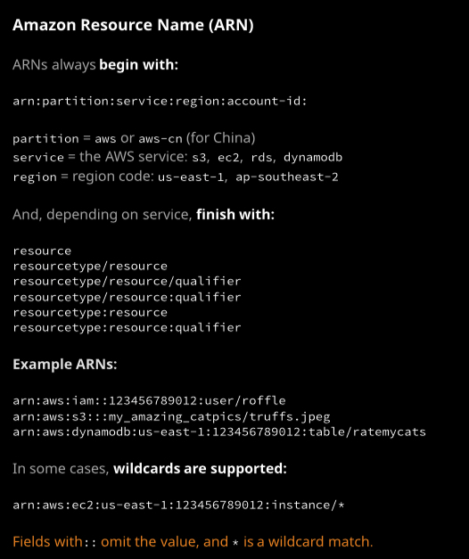

#### Day 4 - Indentity and Access Control

- ARN: Amazon Resourse Name

  ###### 

- User：对应单个的用户，通过policy设定权限
- Groups: 把用户分组；通过policy设定权限
- Roles：不能用role登录。通过policy设定权限，针对资源设定
- IAM Policy
- 缺省情况下，是没有任何访问权限的。