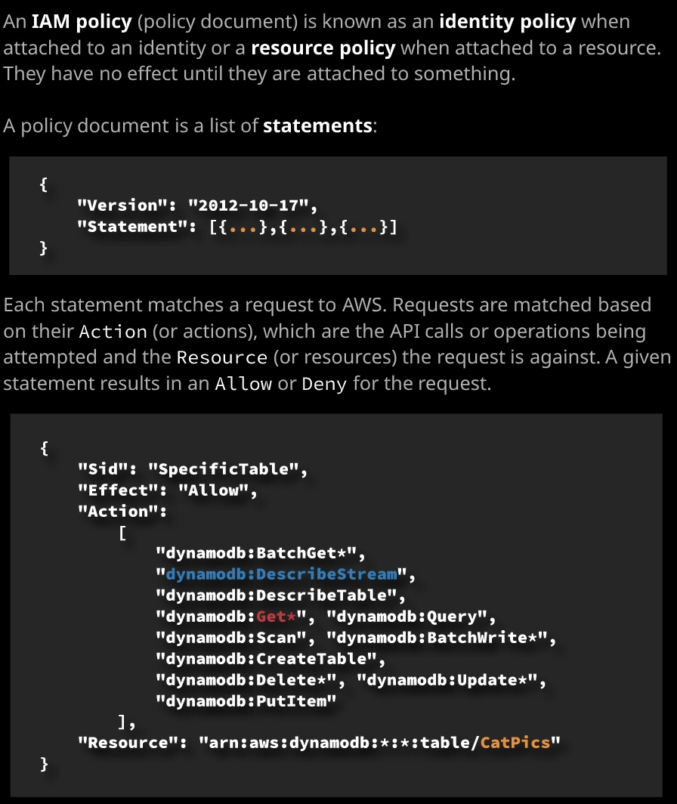
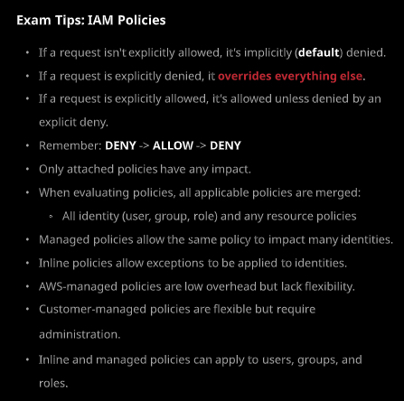

---

layout: post
title: AWS CSA - Associate Level 学习笔记 - Week 1 - Part III
img: image-20190830170450834.png
---

#### Day 4 - Indentity and Access Control

- ARN: Amazon Resourse Name

  ###### 

- User：对应单个的用户，通过policy设定权限
- Groups: 把用户分组；通过policy设定权限
- Roles：不能用role登录。通过policy设定权限，针对资源设定
- IAM Policy
- 缺省情况下，是没有任何访问权限的。

### Day 5

- IAM Policies: 一个声明列表，一个JSON文档。只有当附加到某个对象上的时候才能发挥作用。例如附加到identity上，就成了identity policy，如果附加到资源上，就成为了资源的policy。

  

  

例如上面的例子，就是一个statement，通过key:value的pair定义。Allow对应到具体允许的这些dynamodb的操作，针对的对象时Resource指定的ARN资源。

- inline policy
- amazon-managed policy
- customer-managed policy

Policy的总结：

###### 