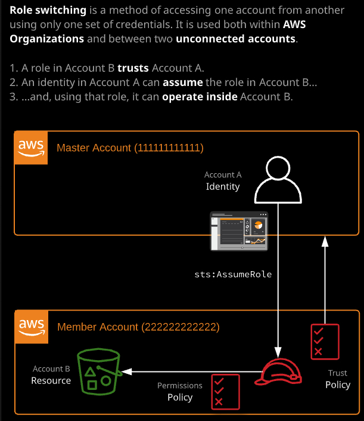
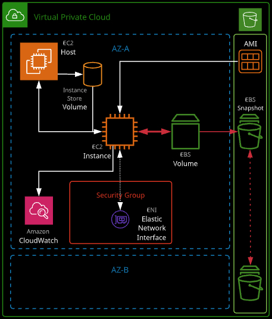

### Day 8

- IAM roles: role的概念很容易理解，但是难点在于掌握什么时候在哪里使用。


一个identity可以assume 一个role，并获取这个role的角色。

每个role有两个policy：

- trust policy: 控制谁可以assume这个role
- permission policy：和其他的IAM policy设置的permission类似

例如，下面的policy就是允许EC2可以assume这个role。

```json
{
  "version": "2012-10-17"
  "Statement": [
  	{
  		"Effect": "Allow",
  		"Principal":{
  			"Service": "ec2.amazonaws.com"
			},
			"Action": "sts:AssumeRole"
		}
  ]
}
```

简单讲，roles，允许identity可以临时的assume一个身份，当获取了身份后，STS会分配一个临时的access key用以访问permission policy里面规定的权限的资源。

- 什么时候用，什么时候不能用？
  - 当需要一个login 的account的时候，不能使用role。roles没有用户名和密码，没有access keys等。
  - roles可以用在很多地方，比如当有很多的用户的时候，可以让这些用户assume 角色，而不需要为每个用户创建一个用户

- AWS Organizations: 

  AWS Organizations is useful for businesses that need to manage multiple accounts. It provides the following features:

  - Consolidated billing
  - Service control policies (SCPs)
  - Account creation
  - Simplified role switching

###### 

当创建organization时，第一个account会被转换成`Master Account`。Master Account只能有一个，并且不能被限制权限。

可以创建两种类型的organization：

1. All features
2. Consolidate billing only

在organization中的其他账户都是member account。如上图中的account [1-4]。

所有购买的services，都可以分享到整个Organization。

- Service control policies：policy设置后，从这层开始一直到树的最末端，该policy都生效。

###### 

- 角色切换 - Role Switching

  ##### 

### Day 9 - EC2 计算资源

EC2是AWS的核心服务之一。虽然其他的公司可以提供虚拟机计算，但是EC2可以提供和AWS中其他的资源交互的功能和机制。这是EC2的强项之一。其实是运行在EC2 host上面的虚拟机，只占用物理机的一个部分资源。

通过AWS创建EC2之前，先创建了key pair。这个key pair是两部分。一个是key 和fingerprint部分，一个是key.pem。key.pem是只有在创建的时候有机会下载。

EC2是运行在一个AWS的网络里面，VPC。所以创建EC2之前需要创建VPC。

EC2是运行在一个特定的AZ中的。

EC2的存储，可以使用两种类型：

- Instance Store Volume：高性能，临时，非持久化的卷。数据会丢失，例如HA，EC2在其他的host启动。
- EBS Volume（Elastic Block Storage）: 可持久化，有快照

###### 