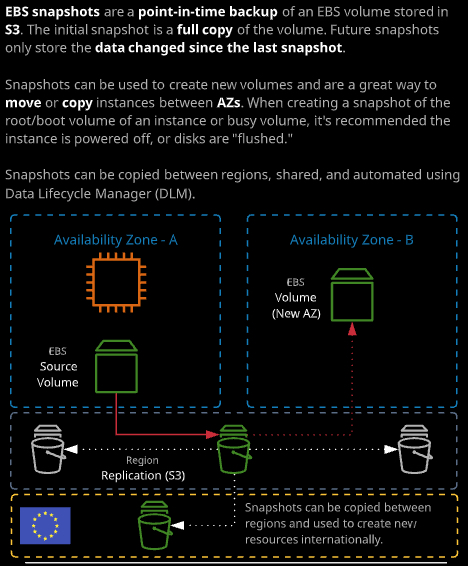
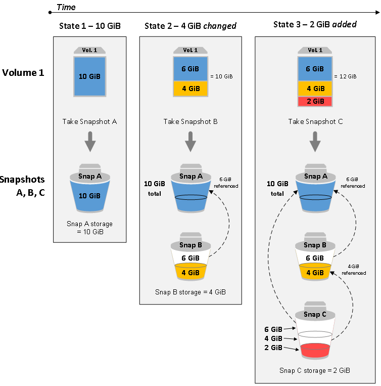

### Day 11

- EBS Snapshots：快照，和NetApp的快照有很大不同。第一次快照拍的是point-in-time的**全拷贝- Full Copy**，不是根节点的复制，所以会比较慢。后续的快照是和上次快照之间的数据差。另外，快照存放在S3中，而不是EBS。EBS本身只能在一个AZ中，但是可以利用快照来创建新的卷，在不同而AZ之间移动和拷贝实例。

- 为EBS卷拍过快照之后，利用该快照创建新的卷，这个新的卷就已经具备了和快照内相同的数据。包括文件系统。[How EBS Snapshots works](https://docs.aws.amazon.com/AWSEC2/latest/UserGuide/EBSSnapshots.html)

- 快照是在Console中拍的，所以并不是application一致性的快照。如果想要保证数据，application的一致性，需要flush 内存，或者停止instance。

- 虽然快照是存放在S3，但是如果从console访问S3，无法看到快照的数据。

- 最佳实践：为root volume拍快照。

- 在利用快照创建新的卷时，可以选择不同的AZ。

- 利用Snapshot的copy功能，可以选择不同的region，从而实现卷的跨区域功能。

  ###### 

快照的工作原理：

##### 

- Security Group - EC2级别的防火墙
- Instance Metadata：实例的元数据

