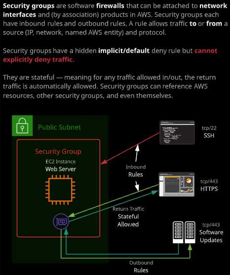
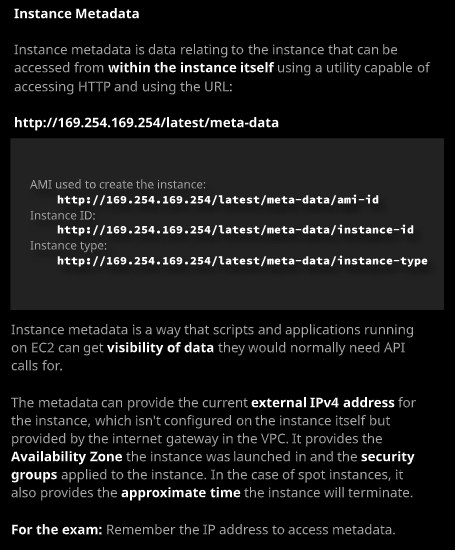

### Day 11

- EBS Snapshots：快照，和NetApp的快照有很大不同。第一次快照拍的是point-in-time的**全拷贝- Full Copy**，不是根节点的复制，所以会比较慢。后续的快照是和上次快照之间的数据差。另外，快照存放在S3中，而不是EBS。EBS本身只能在一个AZ中，但是可以利用快照来创建新的卷，在不同而AZ之间移动和拷贝实例。

- 虽然是增量备份，删除中间的快照并不会让后面拍的快照数据丢失。

- 为EBS卷拍过快照之后，利用该快照创建新的卷，这个新的卷就已经具备了和快照内相同的数据。包括文件系统。[How EBS Snapshots works](https://docs.aws.amazon.com/AWSEC2/latest/UserGuide/EBSSnapshots.html)

- 快照是在Console中拍的，所以并不是application一致性的快照。如果想要保证数据，application的一致性，需要flush 内存，或者停止instance。

- 虽然快照是存放在S3，但是如果从console访问S3，无法看到快照的数据。

- 最佳实践：为root volume拍快照。

- 在利用快照创建新的卷时，可以选择不同的AZ。当然，要利用这个卷，需要在新的AZ中具备EC2的Instance。因为在原来的AZ中的EC2也同样不能够跨AZ。

- 利用Snapshot的copy功能，可以选择不同的region，从而实现卷的跨区域功能。

- 快照的生命周期可以使用DLM（Data Lifecycle Manager）来实现。后续章节会再介绍。

  ###### 

快照的工作原理：

##### 


- Security Group - EC2级别的虚拟防火墙

  - Security groups are an essential part of the EC2 and VPC security toolset. They operate like a virtual firewall, controlling traffic originating from or destined for a network interface (or an instance).

    [User Data](https://github.com/linuxacademy/content-aws-csa2019/blob/master/lesson_files/03_compute/Topic1_Fundamentals/05_SecurityGroups/userdata1.txt)

    ###### 

  - security group由group ID唯一标识；由 ==inbound rule== 和 ==outbound rule== 定义；必须绑定到一个VPC。Security Group绑定在一个EC2实例的网卡上。

  - 隐藏rule：缺省的，deny。

  - Security Group无法指定deny rule，只能设置允许的rule。

  - stateful的，也就是允许出去的规则，也允许inbound的trafic。而Network Access Control 不是stateful的，所以需要两条规则规定inbound和outbound。

  - source的部分还可以指定其他的Security group。例如所有的server 绑定了特定的security group的都可以互相之间用任何方式通讯。

- Instance Metadata：实例的元数据

  - 这里的获取meta data的URL需要记住。

    [http://169.254.169.254/latest/meta-data/](http://169.254.169.254/latest/meta-data/)

  - 例如在EC2中通过命令`curl -s http://169.254.169.254/latest/meta-data/`就可以获取该EC2 实例的meta data。

    `[ec2-user ~]$ curl http://169.254.169.254/latest/meta-data/ami-id `

    `ami-0abcdef1234567890`

  - [EC2 Instance Meta-data资料](https://docs.aws.amazon.com/AWSEC2/latest/UserGuide/ec2-instance-metadata.html)

  ###### 

- Lab: 可以在创建EC2的时候，在Advanced details里面添加EC2启动时执行的指令。例如下面的代码，就可以安装好httpd等服务，并且获取图片，设置好web server并启动。

  ```
  #!/bin/bash
  yum update -y
  yum install -y httpd
  yum install -y wget
  chkconfig httpd on
  cd /var/www/html
  wget https://raw.githubusercontent.com/linuxacademy/content-aws-csa2019/master/lab_files/03_compute/creating_an_ec2_instance/index.html
  wget https://raw.githubusercontent.com/linuxacademy/content-aws-csa2019/master/lab_files/03_compute/creating_an_ec2_instance/catanimated.gif
  wget https://raw.githubusercontent.com/linuxacademy/content-aws-csa2019/master/lab_files/03_compute/creating_an_ec2_instance/rainbow.gif
  wget https://raw.githubusercontent.com/linuxacademy/content-aws-csa2019/master/lab_files/03_compute/creating_an_ec2_instance/penny.jpeg
  wget https://raw.githubusercontent.com/linuxacademy/content-aws-csa2019/master/lab_files/03_compute/creating_an_ec2_instance/roffle.jpeg
  wget https://raw.githubusercontent.com/linuxacademy/content-aws-csa2019/master/lab_files/03_compute/creating_an_ec2_instance/truffs.jpeg
  wget https://raw.githubusercontent.com/linuxacademy/content-aws-csa2019/master/lab_files/03_compute/creating_an_ec2_instance/winkie.jpeg
  service httpd start
  ```

  