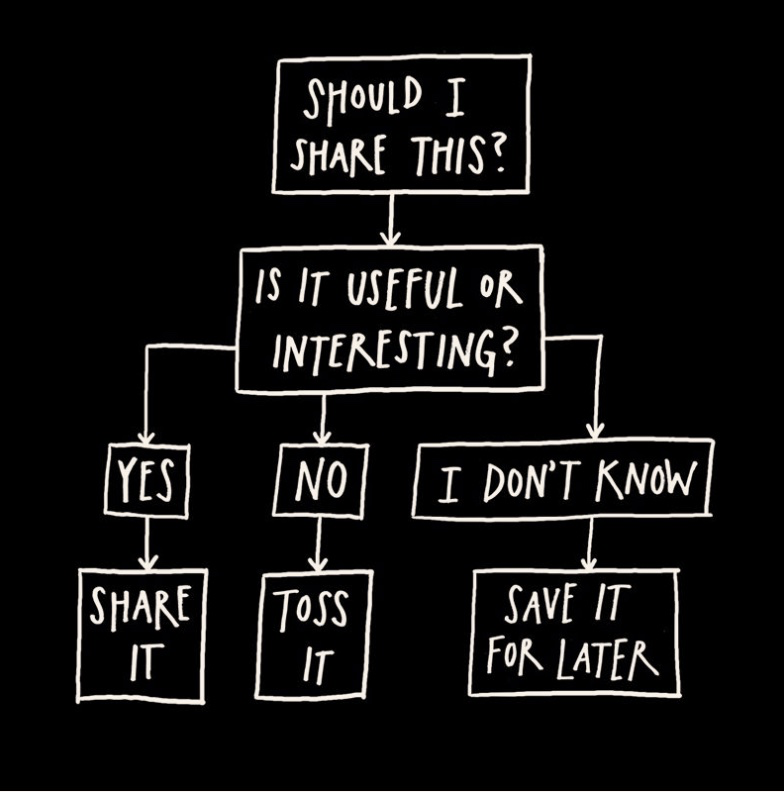
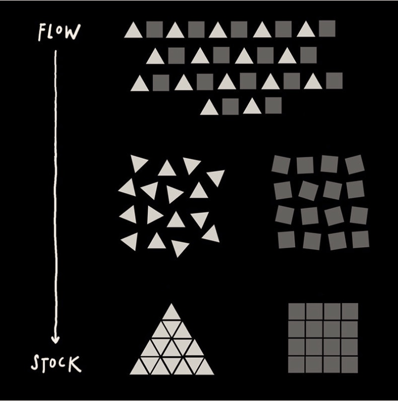

### I: Input 阶段

一种新的操作。

**关键词:** Sharing,分享你的项目，你的工作进度，新的，利用网络，开放，吸引观众，永无终结的项目

可期待的输出：

你的雇主可以通过你的博客了解你，可以建立更多的连接，更多的人支持你。可以开发副业等。或者只是让你把时间和精力花费在你感兴趣事情上。

>“All you have to do is show your work.”

#### 1. You Don't have to be a genius

>“creativity is always, in some sense, a collaboration, the result of a mind connected to other minds.”

**关键词：**==scenius==

想想你可以贡献什么，而不是其他人能为我做什么。

Be an Ameteur - 做一个业余者

> “When Radiohead frontman Thom Yorke was asked what he thought his greatest strength was, he answered, ==“That I don’t know what I’m doing.”== Like one of his heroes, Tom Waits, whenever Yorke ”

#### You can't find your voice if you don't use it.

> “Talk about the things you love. Your voice will follow.”

 #### 2. Think of Process, not product

在数字时代，重要的是把原来在幕后的过程可以通过各种社交媒体随时随地分享。而不仅仅是在你完成一件作品或者一个项目之后，展示成果。

开始一个工作日志：在笔记本上记录你的想法，或者录音。把你工作的过程通过照片记录下来，拍视频，这不是关于艺术，而是记录你的进度。手机，随身带一个笔记本，就够了。

#### 3. Share Something Small EVERY Day

> “Put yourself, and your work, out there every day, and you’ll start meeting some amazing people.”
> —Bobby Solomon”

以天作为单位记录你的进程。在一天结束的时候，拿出你的日志找到可以分享的部分。不同的阶段所分享的内容和角度也有所不同。例如在早期阶段，可以着重在是什么激发了你的想法。

这个每天分享的内容可以是任何形式。博客，Youtube video，等等。

"Send out a Daily Dispatch"

> “One day at a time. It sounds so simple. It actually is simple but it isn’t easy: It requires incredible support and fastidious structuring.”
> —Russell Brand”

**"So What?"**

针对要分享的内容，写下来，放1天，第二天重新审视是否依然值得分享。使用So what来发现这些东西的价值。

是否有用？是否有趣？

分享的是你的 **Work**。 

> If you work on something a little bit every day, you end up with something that is massive.

不但是积少成多，还可以从不断的分享中不断找到**规律，模式**，从而重新构建更加大的成果。

注册一个域名，构建一个网站，博客，让你的网站和你一起成长。不断积累。

### II: Reflection 阶段

####